## 实验一 &nbsp;&nbsp;&nbsp;&nbsp; 实验环境及 DEBUG 使用
### 一. 基础性实验
#### 1. 实验目的
1) 熟悉 **DEBUG** 的功能,运行并掌握其常用命令.
2) 掌握用 **DEBUG** 调试程序的方法.
#### 2. 实验内容
**DEBUG** 的加载及其常用命令 (`D` `E` `F` `R` `G` `A` `T` `U` `N` `L` `W` `Q`) 的使用情况.
#### 3. 实验仪器设备
- 硬件环境: AMD Ryzen 9.
- 软件环境: Windows XP Pro SP3 (in VMware Workstation 16 Pro).
- 调试程序: `DEBUG.EXE`.

#### 4. 实验步骤
##### (1) 进入Debug程序环境
在 VMware Workstation 16 Pro 中使用 Windows XP Pro SP3 镜像(SHA256 `39430C2B8DD5C21BBD5AF9116573F8C574AE896CE31D47280914EF268F01E33F`)安装虚拟机.
复制相关文件到虚拟机, `DEBUG.EXE` 可直接双击打开.
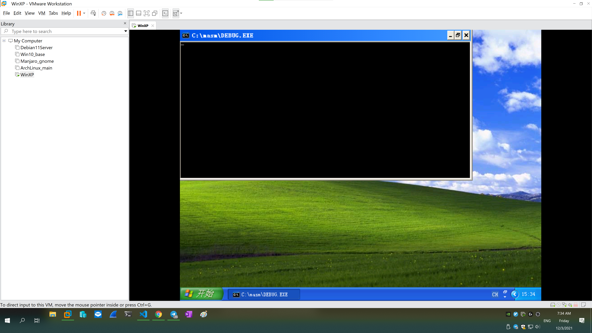
也可使用 **Dosbox** ,相关配置如下.
```batch
[sdl]
fullscreen=false
fulldouble=false
fullresolution=3840x1920
windowresolution=1920x1080
output=overlay
autolock=true
sensitivity=100
waitonerror=true
priority=higher,normal
mapperfile=mapper-0.74.map
usescancodes=true
```
##### (2) 运行程序命令
```py
-t
-t
-t
-t=100
-t=100,3
```
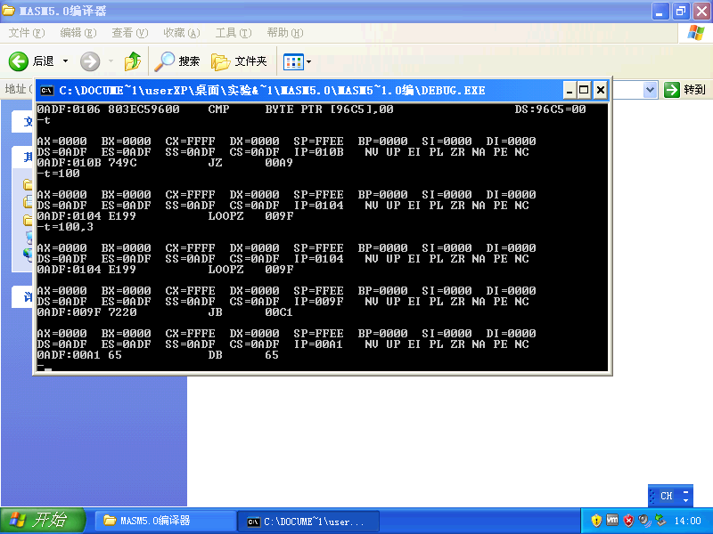
```py
-g=1
```
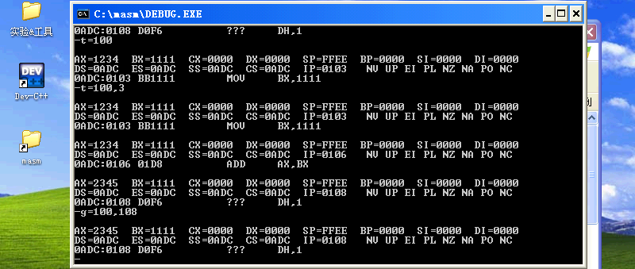
```py
-n qwq
-r bx
:0000
-r cx
:ffff
-w
```
```batch
dir
```
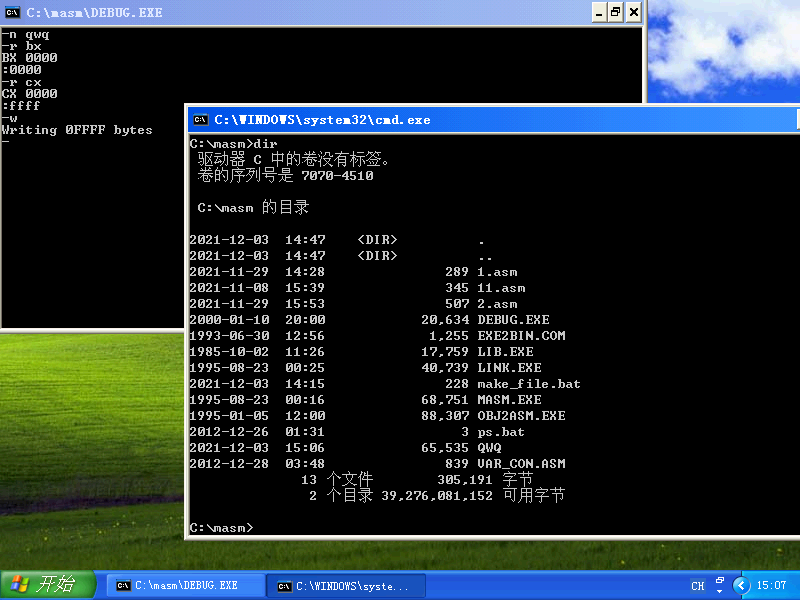
##### (3) 装入文件命令
```py
-n qwq
-l
```
##### (4) 反汇编
```py
-u
```
##### (5) 显示存贮单元命令
```py
-d 100 140
```
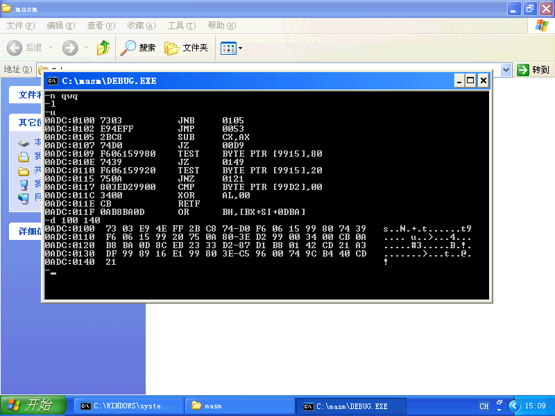
使用hexdump查看文件`QWQ`.
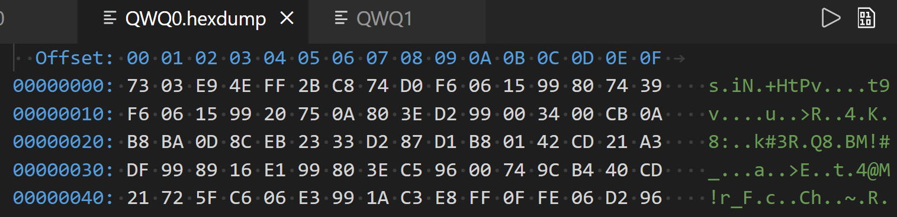
##### (6) 其它命令
```py
-e ds:110
00 01 10 11 32 33  ff ff
-f 0adc:0120 L f 'Qw'
-d 100 13f
-w
```
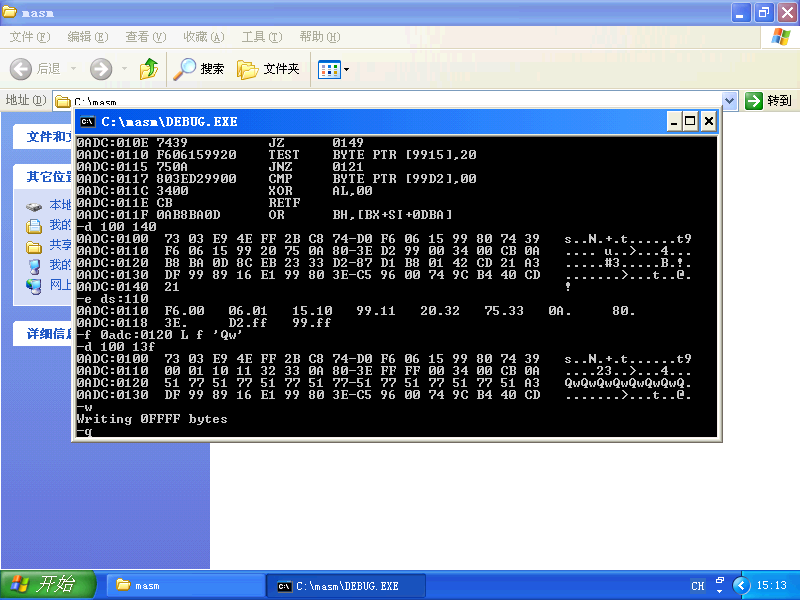
再次使用hexdump查看文件`QWQ`.
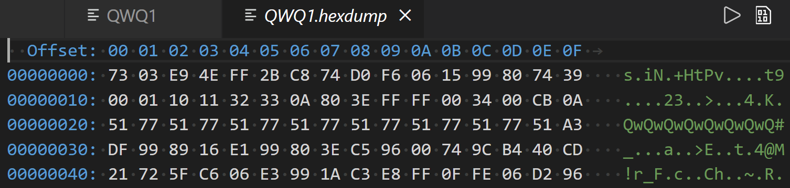
#### 5. 思考题
##### (1) DEBUG 中 `T=100` 与单独的 `T` 指令有何不同? `100` 的含义是什么? `T=100,3` 指令中的 `3` 有何含义? 应如何应用?
`T=100` 满足 `T[=address]` 格式,将会从 `address` (即 `CS:0100` )单元中的指令开始单步执行; `address` 缺省值为 `CS:IP` ,即单独使用 `T` 将会从 `CS:IP` 单元中的指令开始单步执行.
`100` 是指令指针位置.
`T=100,3` 指令中的 `3` 表示执行三步.
##### (2) DEBUG 中 `G=100,108` 命令的 `100,108` 的含义是什么? 说明 `T` 与 `G` 命令的异同.
在 `CS:0108` 处设置断点并从 `CS:0100` 开始执行程序.
`T` 为单步执行, `G` 为连续执行.
##### (3) 说明 `D` 与 `U` 命令的区别.
`D` 直接以十六进制显示文件内容, `U` 显示反汇编所得指令.

### 二. 加强型实验
#### 1. 实验目的
1) 利用 **DEBUG** 掌握有关的命令.
2) 利用 **DEBUG** 运行简单的程序段.
#### 2. 实验内容
用命令 `A` 汇编下列程序段,并将程序写到硬盘上,然后调试程序段,观察程序段能否完成指
定功能,若不能,说明原因,并修改程序.
##### (1) 内存操作数及各种寻址方式使用
```nasm
MOV AX,1000
MOV [1200],AX
MOV BX,1202
MOV BYTE PTR[BX],20
MOV DL,39
INC BX
MOV [BX],DL
DEC DL
MOV SI,3
MOV [BX+SI],DL
MOV [BX+SI+1],DL
MOV WORD PTR[BX+SI+2],1234
```
##### (2) 多字节加法程序
```nasm
        MOV DI,1234
        MOV CX,8
        MOV SI,2234
        CLC
Again:  MOV AL,[SI]
        ADC [DI],AL
        INC SI
        INC DI
        LOOP Again
```
##### (3) 移位操作
```nasm
MOV AL,06
SHL AL,1
MOV BL,AL
MOV CL,2
SHL AL,CL
ADD AL,BL
```
##### (4) 数据串移动
用 `A` 命令 `DB` 伪指令在 `1000H` 键入下列字符串: `This's a string.`.
用 `A` 命令键入下列程序:
```nasm
    MOV SI,1000
    MOV DI,2000
    MOV CX,0FH
LOP:MOV AL,[SI]
    MOV [DI],AL
    INC SI
    INC DI
    LOOP LOP
    INT 20
```

#### 3. 实验仪器设备
- 硬件环境: AMD Ryzen 9.
- 软件环境: Windows XP Pro SP3 (in VMware Workstation 16 Pro).
- 编辑程序: Visual Studio Code 1.62.3.
- 调试程序: `DEBUG.EXE`.

#### 4. 实验步骤
##### (1) 内存操作数及各种寻址方式使用
原程序不需要修改.
运行和查看结果:
```py
-a
# 程序段
-g 120
-d 1200 120f
```
立即寻址、寄存器寻址、直接寻址、寄存器间接寻址、变址寻址、寄
存器相对寻址等寻址方式的样例.
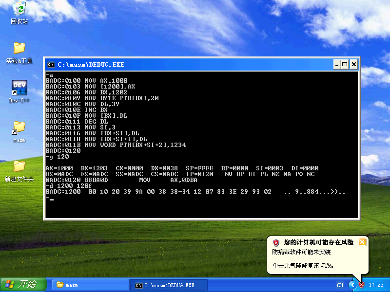
##### (2) 多字节加法程序
修改后程序:
```nasm
MOV DI,1234
MOV CX,8
MOV SI,2234
CLC
MOV AL,[SI]
ADC [DI],AL
INC SI
INC DI
LOOP 010A
```
运行和查看结果:
```py
-a
# 程序段
-d 1230 123f
-d 2230 223f
-g 112
-d 1230 123f
-d 2230 223f
```
将 `DS:1234` 处(小端模式)存储的 **64-bit** 整数与 `DS:2234` 处(小端模式)存储的 **64-bit** 整数相加并存回 `DS:1234` 处.
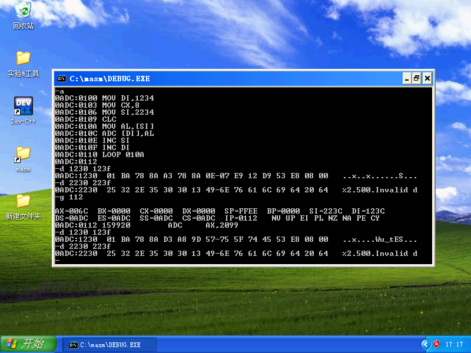
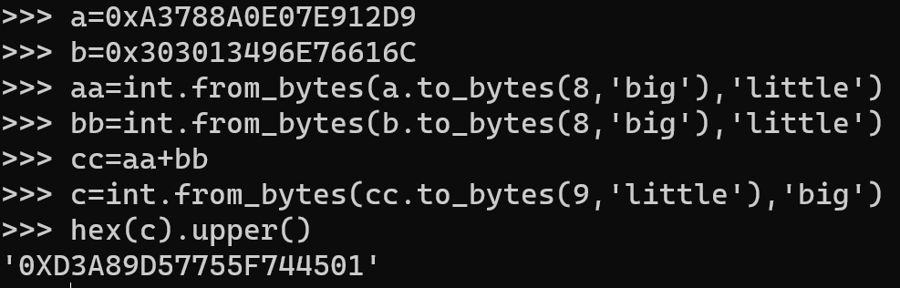
##### (3) 移位操作
原程序不需要修改.
运行和查看结果:
```py
-a
# 程序段
-g 10C
```
计算 $((6<<1)+(6<<(1+2))).$
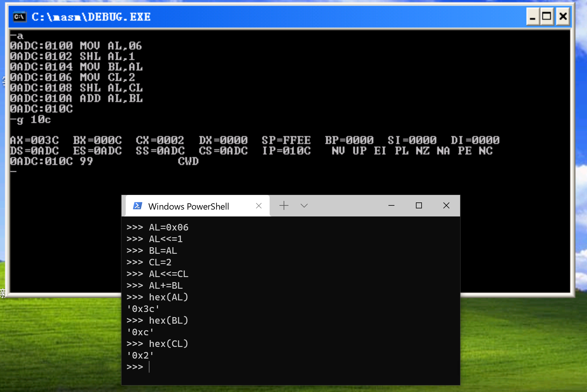
##### (4) 数据串移动
修改后程序:
```nasm
MOV SI,1000
MOV DI,2000
MOV CX,0F
MOV AL,[SI]
MOV [DI],AL
INC SI
INC DI
LOOP 109
```
运行和查看结果:
```py
-a
# 程序段
-a 1000
db "This's a string."
-g 111
-d 2000 201f
```
将 `1000H` 处开始的 `0x0f` 个字节(即字符串 `This's a string.` )复制至 `2000H` 处.
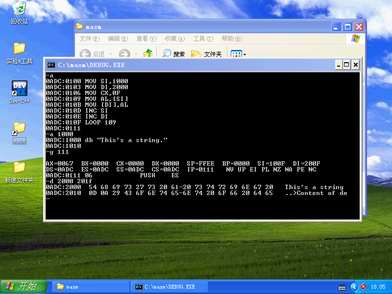

#### 5. 思考题
##### (1) 假设某内存单元的内容为 `CCH`, 试问该内容如看作一条指令/无符号数/带符号数,那将分别表示什么? 不查看教材中的指令系统代码,如何在 DEBUG 下知道 `CCH` 表示一条什么指令?
指令: `INT 3`;
无符号数: 204;
带符号数(8-bit): 52.
```py
-e 100
cc
-u 100 100
```
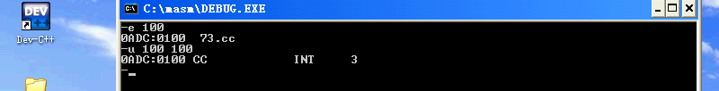
##### (2) 在指令 `MOV [BX],AX` 中,操作数 `[BX]` 的寻址方式是什么？在 DEBUG 下执行完该指令后,如何查看执行结果?
寄存器间接寻址.
使用 `D` 命令查看相应地址数据.
##### (3) 可否随意在 DEBUG 提示符 `－` 后不带参数发出命令 `G`? 什么情况下使用命令 `G` 时，可不用 `=` 给出执行的首地址?
否.
`CS:IP` 正确时.
