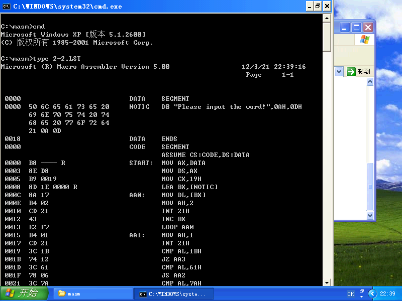
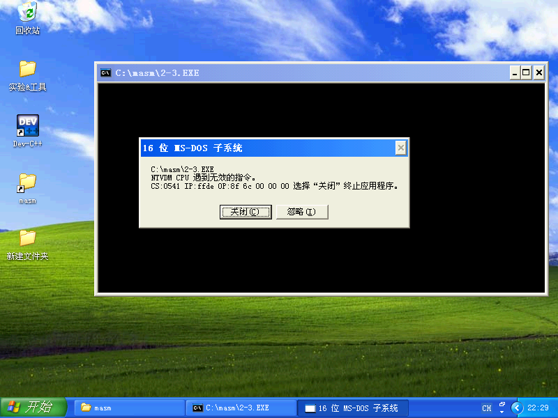

## 实验二 &nbsp;&nbsp;&nbsp;&nbsp; 汇编语言程序结构
### 一. 基础性实验
#### 1. 实验目的
1) 掌握汇编语言程序上机过程.
2) 掌握汇编语言结构.
3) 学习汇编语言的伪操作.
4) 了解汇编程序、连接程序、**DOS** 系统装入和返回功能.
5) 掌握用 **DEBUG** 调试汇编语言程序的方法.
#### 2. 实验内容
编写完整的汇编语言程序: 从变量 `DD1` 开始存放 $3$ 个无符号字节数据,编制一个找出其中最大者存入 `DD2` 单元的源程序.
#### 3. 实验仪器设备
- 硬件环境: AMD Ryzen 9.
- 软件环境: Windows XP Pro SP3 (in VMware Workstation 16 Pro).
- 编辑程序: Visual Studio Code 1.62.3.
- 调试程序: `DEBUG.EXE`.
- 编译程序: `MASM.EXE`.
- 连接程序: `LINK.EXE`.

#### 4. 实验步骤
##### (1) 建立汇编语言程序源文件
##### (2) 汇编文件,形成目标模块
若文件有语法错误,根据错误提示,返回(1),修改源文件;
若无错,则形成 `.OBJ` 目标文件和 `.LST` 列表文件.
##### (3)连接目标模块,形成可执行文件
若有错,根据错误提示,返回(1),修改错误;
若无错,则形成 `.EXE` 可执行文件和 `.MAP` 映像文件.
##### (4)执行
DOS下直接键入可执行文件名,即可执行该程序.
若运行结果不对,需调试程序,查找原因:
1) 返回步骤(1)查看源文件,查找错误,修改文件;
2) 若无法通过查看源文件找出错误,可在 **DEBUG** 下调试 `.EXE` 文件,找出错误之处,再返回步骤(1)修改源文件.

可使用如下脚本快速编译连接:
```batch
@REM code by hyper
@REM edit by userElaina
set /p file="Enter file name: "
set CC=masm.exe
set LD=link.exe
echo _compile_
%CC% %file%.asm
echo _link_
%LD% %file%.obj
echo _execute_
%file%.exe
pause
```
#### 5. 思考题
##### (1) 汇编语言程序中语句 `END` 后的标号作用是什么?
程序结束.
##### (2) 一个段的大小为多少? 一定是 64KB 吗? 如何在 DEBUG 下查看程序在内存的存放情况?
一个段的大小通常为 **64KB**.
不一定.
使用 `D` 命令查看.

### 二. 加强型实验
#### 1. 实验目的
1) 进一步熟悉 **DEBUG** 的使用方法.
2) 掌握汇编语言程序的编辑/汇编/连接以及调试过程.
#### 2. 实验内容
试编写一个汇编语言程序,要求对键盘输入的小写字母用大写字母显示出来.
#### 3. 实验仪器设备
- 硬件环境: AMD Ryzen 9.
- 软件环境: Windows XP Pro SP3 (in VMware Workstation 16 Pro).
- 编辑程序: Visual Studio Code 1.62.3.
- 调试程序: `DEBUG.EXE`.
- 编译程序: `MASM.EXE`.
- 连接程序: `LINK.EXE`.

#### 4. 实验步骤
1) 编译和连接.
2) 用 `TYPE` 命令显示(1)产生的 `.LST` 文件.

3) 运行.
4) 键入大量字符.
5) 按 `ESC` 退出.

#### 5. 思考题
##### (1) 若在源程序中把 `INT 21H` 的 `H` 省去,会产生什么现象?
正常编译连接,运行后无反应,一段时间后弹出错误.

##### (2) 把 `INT 21H` `4CH`号功能改为 `INT 20H`, 行不行?
不行.
正常编译连接,运行后显示功能正常,但按 `ESC` 无法回到DOS,同时光标在界面内快速跳跃闪动,CPU消耗大幅度增加.
若直接双击运行,则按 `ESC` 时直接退出.
