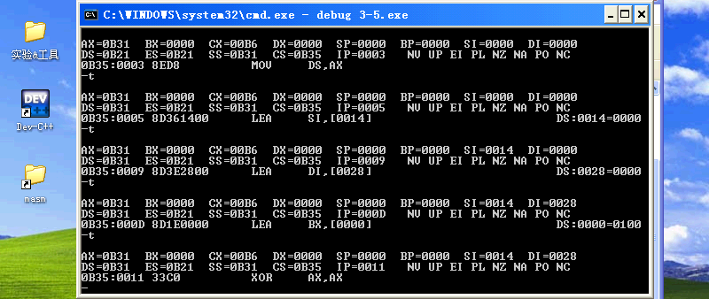
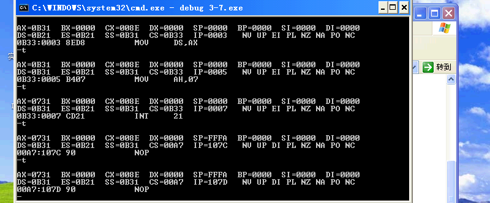
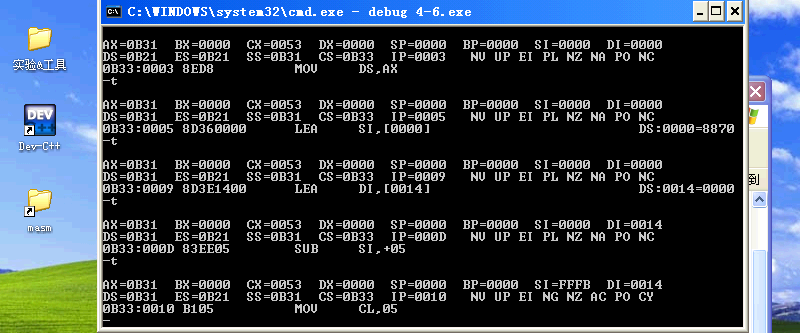

# 实验二
## (1/2)分支程序设计
### 一. 基础性实验
#### 1. 实验目的
1) 掌握多路分支 `if...elif...else` 程序结构和设计方法.
2) 进一步熟悉 **DEBUG** 的使用方法.
3) 掌握汇编语言程序的编辑,汇编,连接以及调试过程.
#### 2. 实验内容
编写程序,将一个包含有 $20$ 个数据的数组 $M$ 分成两个数组: 正数数组 $P$ 和负数数组 $N,$ 并分别显示这两个数组长度.
#### 3. 实验仪器设备
- 硬件环境: AMD Ryzen 9.
- 软件环境: Windows XP Pro SP3 (in VMware Workstation 16 Pro).
- 编辑程序: Visual Studio Code 1.62.3.
- 调试程序: `DEBUG.EXE`.
- 编译程序: `MASM.EXE`.
- 连接程序: `LINK.EXE`.

#### 4. 实验步骤
1) 编译和连接
2) 用单步方式运行程序
```batch
debug 3-5.exe
```
```py
-t
```
3) 检查并记录各寄存器和存储单元内容的变化


#### 5. 思考题
##### (1) 示例题中是否一定要用 `CMP` 指令来实现条件转移? 如果不是,请设计出替代程序.
否.
使用额外的寄存器和 `SUB` 替代 `CMP`.
```nasm
DSEG    SEGMENT PARA PUBLIC'DSEG'
M       DB 0,1,2,3,4,5,6,7,8,9,10,11,12,13,14,15,16,17,18,19
P       DB 20 DUP(?)
N       DB 20 DUP(?)
DSEG    ENDS
CODE    SEGMENT
        ASSUME CS:CODE,DS:DSEG
START:  MOV AX,DSEG
        MOV DS,AX
        LEA SI,P
        LEA DI,N
        LEA BX,M
        XOR AX,AX
        XOR DX,DX
        MOV CX,20
L1:     MOV AL,[BX]
        TEST AL,80H
        JZ L2
        MOV [DI],AL
        INC BX
        INC DI
        INC DH
        JMP L3
L2:     MOV [SI],AL
        INC BX
        INC SI
        INC DL
L3:     LOOP L1
        MOV CX,2
L5:     MOV BL,DL
        SHR DL,1
        SHR DL,1
        SHR DL,1
        SHR DL,1
        AND DL,0FH
        MOV AX,DL
        SUB AX,10
        JB L4
        ADD DL,7
L4:     ADD DL,30H
        MOV AH,2
        INT 21H
        MOV DL,BL
        AND DL,0FH
        MOV AX,DL
        SUB AX,10
        JB L6
        ADD DL,7
L6:     ADD DL,30H
        MOV AH,2
        INT 21H
        MOV DL,0AH
        MOV AH,2
        INT 21H
        MOV DL,0DH
        MOV AH,2
        INT 21H
        MOV DL,DH
        LOOP L5
        MOV AH,4CH
        INT 21H
CODE    ENDS
        END START
```

### 二. 加强型实验
#### 1. 实验目的
1) 进一步掌握多路分支 `if elif else` 程序结构和设计方法.
2) 进一步熟悉 **DEBUG** 的使用方法.
#### 2. 实验内容
接收键盘输入字符，判别该字符是否为字母、数字或非字母也非数字类的字符。若是数字，
则显示“DIGIT”；若是字母，显示“LETTER”；若是非数字也非字母类的字符，则显示“OTHER”。
#### 3. 实验仪器设备
- 硬件环境: AMD Ryzen 9.
- 软件环境: Windows XP Pro SP3 (in VMware Workstation 16 Pro).
- 编辑程序: Visual Studio Code 1.62.3.
- 调试程序: `DEBUG.EXE`.
- 编译程序: `MASM.EXE`.
- 连接程序: `LINK.EXE`.

#### 4. 实验步骤
1) 编译和连接
2) 用单步方式运行程序
```batch
debug 3-7.exe
```
```py
-t
```
3) 检查并记录各寄存器和存储单元内容的变化


#### 5. 思考题
##### (1) 如果实验题中还需进一步对大小写字母进行区分,如何编写程序?
由于源程序中对大小写字母输入的处理是分离的,直接增加数据 `UPPER` `LOWER`,并更改 `LEA` 语句即可.
```nasm
DATA    SEGMENT
DIGIT   DB "DIGIT",0AH,0DH
UPPER  DB "UPPER",0AH,0DH
LOWER  DB "LOWER",0AH,0DH
OTHER   DB "OTHER",0AH,0DH
DATA    ENDS
CODE    SEGMENT
        ASSUME CS:CODE,DS:DATA
START:  MOV AX,DATA
        MOV DS,AX
        MOV AH,07
        INT 21H
        CMP AL,30H
        JB AA1
        CMP AL,39H
        JA AA1
        MOV CX,7
        LEA SI,DIGIT
AA0:    MOV DL,[SI]
        MOV AH,2
        INT 21H
        INC SI
        LOOP AA0
        JMP BB
AA1:    CMP AL,41H
        JB AA3
        CMP AL,5AH
        JA AA2
        LEA SI,UPPER
        MOV CX,8
AA4:    MOV DL,[SI]
        MOV AH,2
        INT 21H
        INC SI
        LOOP AA4
        JMP BB
AA2:    CMP AL,61H
        JB AA3
        CMP AL,7AH
        JA AA3
        LEA SI,LOWER
        MOV CX,8
AA5:    MOV DL,[SI]
        MOV AH,2
        INT 21H
        INC SI
        LOOP AA5
        JMP BB
AA3:    LEA SI,OTHER
        MOV CX,7
AA6:    MOV DL,[SI]
        MOV AH,2
        INT 21H
        INC SI
        LOOP AA6
BB:     MOV AH,4CH
        INT 21H
CODE    ENDS
        END START
```

## (2/2)循环程序设计
### 一. 基础性实验
#### 1. 实验目的
循环结构程序设计是使用循环控制类指令,实现对某程序段重复执行一定的次数. 通过本次实验,使学生初步掌握单重/多重循环程序的设计方法,为编制较大的程序和阅读较复杂程序打下基础.
#### 2. 实验内容
设有 $5$ 个学生参加 $4$ 门课的考试,其中 $4$ 门课的成绩以 **压缩BCD码** 方式存放在字组 `COURSE1` 中(设每门课的成绩满分为 $99$ 分);试编制计算每个学生总分(总分存入字组 `NUM1` 中)的源程序.
#### 3. 实验仪器设备
- 硬件环境: AMD Ryzen 9.
- 软件环境: Windows XP Pro SP3 (in VMware Workstation 16 Pro).
- 编辑程序: Visual Studio Code 1.62.3.
- 调试程序: `DEBUG.EXE`.
- 编译程序: `MASM.EXE`.
- 连接程序: `LINK.EXE`.

#### 4. 实验步骤
1) 编译和连接
2) 用单步方式运行程序
```batch
debug 4-6.exe
```
```py
-t
```


3) 检查并记录各寄存器和存储单元内容的变化

#### 5. 思考题
##### (1) 在示例题中, `JNZ` 指令的作用是什么?
(嵌套)循环.
##### (2) 本次实验中,出现了哪些错误? 如何排除?
无.
无需排除.

### 二. 加强型实验
#### 1. 实验目的
进一步掌握循环结构程序设计是使用循环控制类指令.
#### 2. 实验内容
将一个 $4\times4$ 的矩阵与一个 $4\times1$ 的矩阵相乘,并将所得的矩阵存入单元中.
#### 3. 实验仪器设备
- 硬件环境: AMD Ryzen 9.
- 软件环境: Windows XP Pro SP3 (in VMware Workstation 16 Pro).
- 编辑程序: Visual Studio Code 1.62.3.
- 调试程序: `DEBUG.EXE`.
- 编译程序: `MASM.EXE`.
- 连接程序: `LINK.EXE`.

#### 4. 实验步骤
1) 编译和连接
2) 用单步方式运行程序
```batch
debug 4-7.exe
```
```py
-t
```


3) 检查并记录各寄存器和存储单元内容的变化
