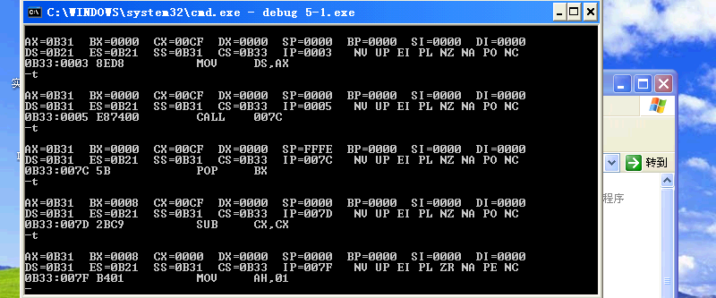
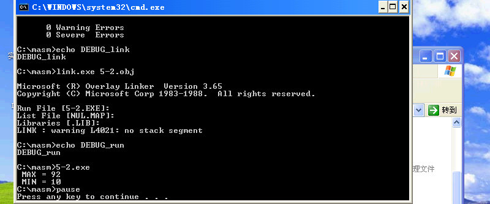
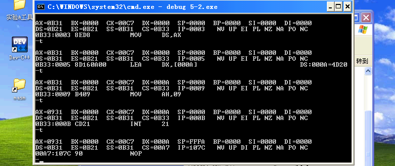
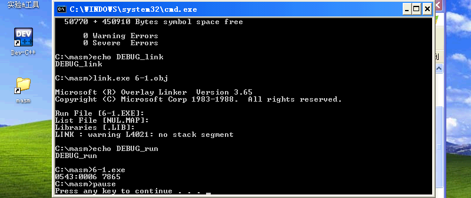
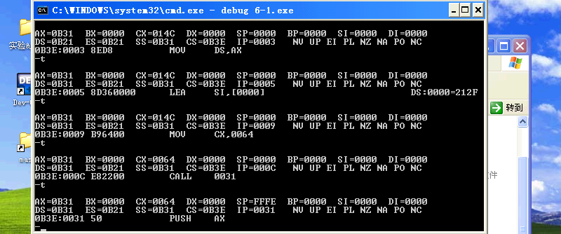
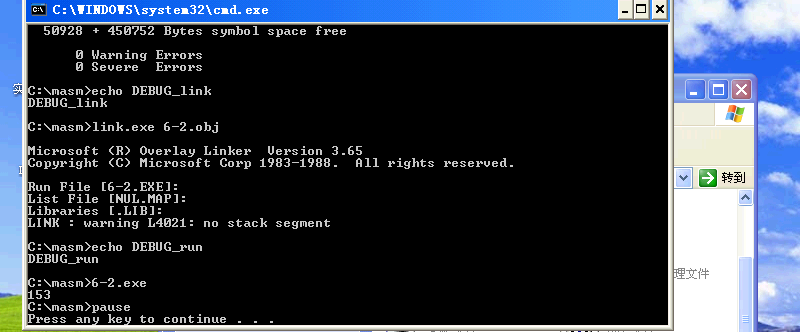
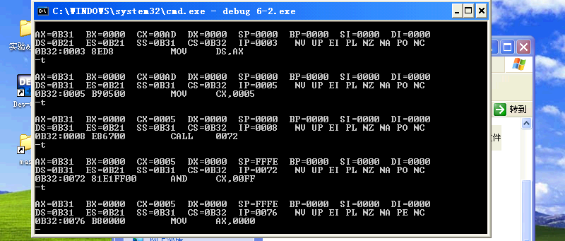

# 实验三
##  (1/2)子程序设计一
### 一. 基础性实验
#### 1. 实验目的
1) 掌握主程序和子程序之间的调用关系及其调用方法.
2) 掌握子程序调用过程中近程调用与远程调用的区别。
3) 掌握子程序设计方法,能合理划分子程序.
4) 掌握汇编子程序的定义/调用/返回/参数传递等有关问题的实现,以及运行过程中的堆栈和标志位变化情况.
#### 2. 实验内容
用堆栈传送参数和参数表地址方式,编制键入 **8-bit非压缩 BCD 码** 加法并显示的程序.
#### 3. 实验仪器设备
- 硬件环境: AMD Ryzen 9.
- 软件环境: Windows XP Pro SP3 (in VMware Workstation 16 Pro).
- 编辑程序: Visual Studio Code 1.62.3.
- 调试程序: `DEBUG.EXE`.
- 编译程序: `MASM.EXE`.
- 连接程序: `LINK.EXE`.

#### 4. 实验步骤
1) 检查并修改原程序
2) 编译和连接
3) 用单步方式运行程序
```batch
debug 5-1.exe
```
```py
-t
```
4) 检查并记录各寄存器和存储单元内容的变化



#### 5. 思考题
##### (1) 说明调用指令 `CALL` 和无条件转移指令 `JMP` 的区别及应用.
`JMP` 指令永久地改变程序计数器,不在堆栈中留下信息.
`CALL` 指令在堆栈中留下信息,这样可以恢复原来的程序执行顺序. `CALL` 是一条将程序控制权转移到子程序的指令,目的是回到主程序中.
`JMP` 常用于形成循环和直接跳转.
`CMP` 常用于函数的调用.

### 二. 加强型实验
#### 1. 实验目的
进一步掌握主程序和子程序之间的调用关系及其调用方法.
#### 2. 实验内容
编写程序求数据区中 $10$ 个无符号数中的最大值和最小值,结果分别存入 `MAX` 和 `MIN` 单元中,要求最大值和最小值分别用子程序完成计算,主程序和子程序之间通过寄存器传递参数.
#### 3. 实验仪器设备
- 硬件环境: AMD Ryzen 9.
- 软件环境: Windows XP Pro SP3 (in VMware Workstation 16 Pro).
- 编辑程序: Visual Studio Code 1.62.3.
- 调试程序: `DEBUG.EXE`.
- 编译程序: `MASM.EXE`.
- 连接程序: `LINK.EXE`.

#### 4. 实验步骤
1) 检查并修改原程序
2) 编译和连接

1) 用单步方式运行程序
```batch
debug 5-2.exe
```
```py
-t
```
4) 检查并记录各寄存器和存储单元内容的变化


## (2/2)子程序设计二
### 一. 基础性实验
#### 1. 实验目的
1) 强化主程序和子程序之间的调用关系及其调用方法.
2) 掌握嵌套子程序的设计以及调用方法.
3) 掌握递归调用子程序的方法.
#### 2. 实验内容
试编制在 `ARRAY1` 无符号数组中,选出最大值及其所在的位置,然后以 $10$ 进制数形式显示在 `CRT` 上的源程序.
#### 3. 实验仪器设备
- 硬件环境: AMD Ryzen 9.
- 软件环境: Windows XP Pro SP3 (in VMware Workstation 16 Pro).
- 编辑程序: Visual Studio Code 1.62.3.
- 调试程序: `DEBUG.EXE`.
- 编译程序: `MASM.EXE`.
- 连接程序: `LINK.EXE`.

#### 4. 实验步骤
1) 检查并修改原程序
2) 编译和连接

3) 用单步方式运行程序
```batch
debug 6-1.exe
```
```py
-t
```
4) 检查并记录各寄存器和存储单元内容的变化



### 二. 加强型实验
#### 1. 实验目的
进一步掌握主程序和子程序之间的调用关系及其调用方法.
#### 2. 实验内容
用子程序结构编程计算: $S=1!+2!+3!+4!+5!.$
#### 3. 实验仪器设备
- 硬件环境: AMD Ryzen 9.
- 软件环境: Windows XP Pro SP3 (in VMware Workstation 16 Pro).
- 编辑程序: Visual Studio Code 1.62.3.
- 调试程序: `DEBUG.EXE`.
- 编译程序: `MASM.EXE`.
- 连接程序: `LINK.EXE`.

#### 4. 实验步骤
1) 检查并修改原程序
2) 编译和连接

3) 用单步方式运行程序
```batch
debug 6-2.exe
```
```py
-t
```
4) 检查并记录各寄存器和存储单元内容的变化

