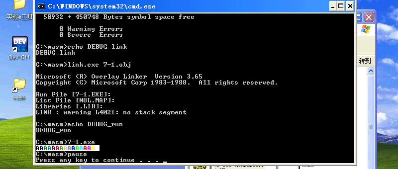
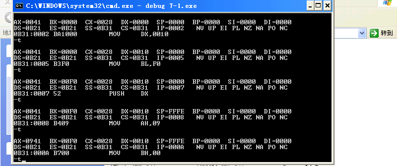
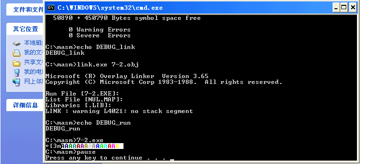
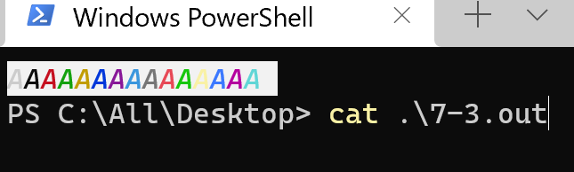
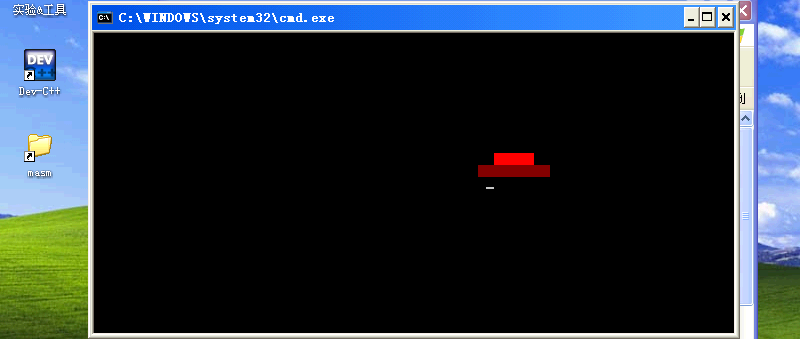
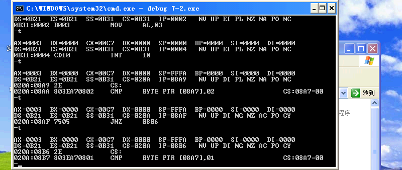
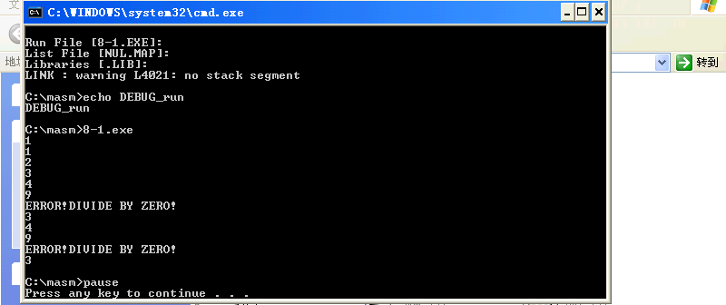
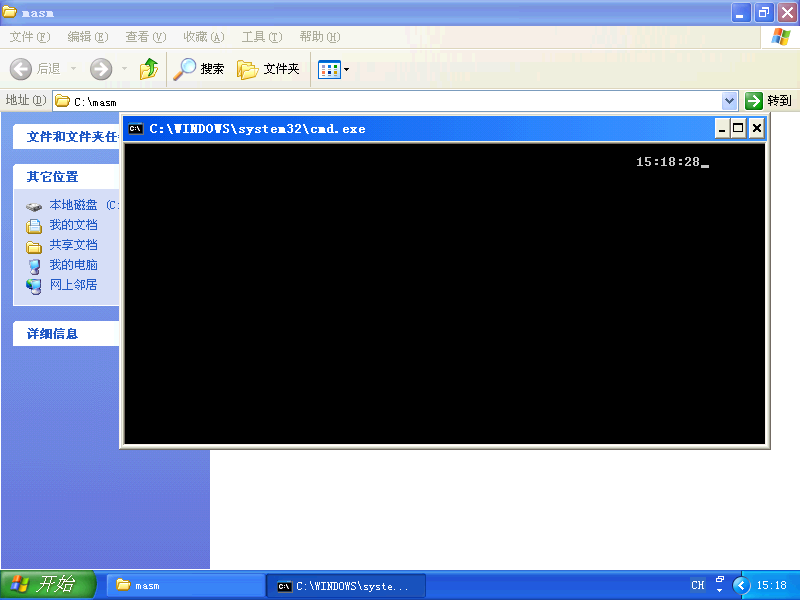
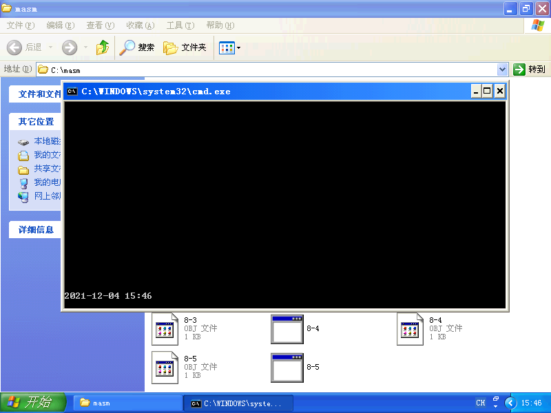

# 实验四
##  (1/2)常用系统中断的使用
### 一. 基础性实验
#### 1. 实验目的
1) 掌握在 **DOS** 中对屏幕和键盘中断的调用方法.
2) 掌握在 **BIOS** 中对屏幕和键盘中断的调用方法.
#### 2. 实验内容
在屏幕上显示背景色为白色,前景色不同的 $16$ 个字符 `A`.
#### 3. 实验仪器设备
- 硬件环境: AMD Ryzen 9.
- 软件环境: Windows XP Pro SP3 (in VMware Workstation 16 Pro).
- 编辑程序: Visual Studio Code 1.62.3.
- 调试程序: `DEBUG.EXE`.
- 编译程序: `MASM.EXE`.
- 连接程序: `LINK.EXE`.

#### 4. 实验步骤
1) 检查并修改原程序
2) 编译和连接

3) 用单步方式运行程序
```batch
debug 7-1.exe
```
```py
-t
```
4) 检查并记录各寄存器和存储单元内容的变化



#### 5. 思考题
##### (1) 若要将程序中的字符以斜线方式显示,应该如何修改指令?
可使用 **ANSI** 控制符 `\x1b[3m` 使后文成为斜体.
```nasm
DATA    SEGMENT
ANSI    DB 1BH,"[3m","$"
DATA    ENDS
CODE    SEGMENT
        ASSUME CS:CODE,DS:DATA
START:  MOV AX,DATA
        MOV DS,AX
        MOV AH,9
        MOV DX,OFFSET ANSI
        INT 21H
        MOV AL,'A'
        MOV DX,10H
        MOV BL,0F0H
A1:     PUSH DX
        MOV AH,9
        MOV BH,0
        MOV CX,1
        INT 10H
        MOV AH,3
        MOV BH,0
        INT 10H
        INC DL
        MOV AH,2
        INT 10H
        ADD BL,1
        POP DX
        DEC DX
        JNZ A1
        MOV AH,4CH
        INT 21H
CODE    ENDS
        END START
```
常见现代终端如 **Konsole**, **Windows Terminal** 均支持 **ANSI**, 但如 **Dosbox** 和 **CMD** 原生终端均不支持.

在 **Windows XP** 中,可通过编辑配置文件使 **CMD** 原生终端部分支持 **ANSI**:
```batch
echo "Please run as Administrator."
echo "device=%SystemRoot%\system32\ansi.sys" >> C:\WINDOWS\system32\CONFIG.NT
echo "Please reboot."
pause
```
但由于字体缺失,斜体和非斜体显示效果相同.
因此,为方便查看结果,决定将所有输出输出到标准输出.
```nasm
DATA    SEGMENT
ANSI    DB 1BH,"[256F",1BH,"[0J",1BH,"[3;107mA",1BH,"[30mA",1BH,"[31mA",1BH,"[32mA",1BH,"[33mA",1BH,"[34mA",1BH,"[35mA",1BH,"[36mA",1BH,"[90mA",1BH,"[91mA",1BH,"[92mA",1BH,"[93mA",1BH,"[94mA",1BH,"[95mA",1BH,"[96mA",1BH,"[97mA",1BH,"[0m",0AH,"$"
DATA    ENDS
CODE    SEGMENT
        ASSUME CS:CODE,DS:DATA
START:  MOV AX,DATA
        MOV DS,AX
        MOV AH,9
        MOV DX,OFFSET ANSI
        INT 21H
        MOV AH,4CH
        INT 21H
CODE    ENDS
        END START
```
运行时进行输出重定向:
```batch
7-3 2>&1 1>7-3.out
```
最后在现代终端中查看:
```batch
cat ./7-3.out
```


### 二. 加强型实验
#### 1. 实验目的
进一步掌握在 **BIOS** 中对屏幕和键盘中断的调用方法.
#### 2. 实验内容
利用视频显示调用,实现简单的动画,在屏幕上显示一个水平开动的汽车.
#### 3. 实验仪器设备
- 硬件环境: AMD Ryzen 9.
- 软件环境: Windows XP Pro SP3 (in VMware Workstation 16 Pro).
- 编辑程序: Visual Studio Code 1.62.3.
- 调试程序: `DEBUG.EXE`.
- 编译程序: `MASM.EXE`.
- 连接程序: `LINK.EXE`.

#### 4. 实验步骤
1) 检查并修改原程序
2) 编译和连接

1) 用单步方式运行程序
```batch
debug 5-2.exe
```
```py
-t
```
4) 检查并记录各寄存器和存储单元内容的变化


## (2/2)中断处理程序设计
### 一. 基础性实验
#### 1. 实验目的
1) 学习和了解汇编语言程序设计中有关中断处理的相关知识.
2) 了解汇编语言程序设计中软中断的基本编写步骤.
#### 2. 实验内容
1) 编写一个中断处理程序,当主程序中除法指令除数为 $0$ 时,显示字符串`ERROR!DIVIDE BY ZERO!`, 并将除数置为 $3.$
2) 为了验证该中断处理程序是否有效,编写一个主程序,做 $10$ 次 $\rm9/BL,$ 在屏幕上显示商 $\rm,BL$ 中初始数据为 $6,$ 每除一次 $\rm,BL$ 中除数 $-1.$
#### 3. 实验仪器设备
- 硬件环境: AMD Ryzen 9.
- 软件环境: Windows XP Pro SP3 (in VMware Workstation 16 Pro).
- 编辑程序: Visual Studio Code 1.62.3.
- 调试程序: `DEBUG.EXE`.
- 编译程序: `MASM.EXE`.
- 连接程序: `LINK.EXE`.

#### 4. 实验步骤
1) 检查并修改原程序
原程序当出现除数为 $0$ 时,会显示错误提示,然后结束程序.
`A2` 中处理完中断后返回 `A1` 即可.
为不影响循环次数,使用 `LOOP A1`.
```nasm
DATA    SEGMENT
STRING  DB 'ERROR!DIVIDE BY ZERO!',0AH,0DH,'$'
CODE    SEGMENT
        ASSUME CS:CODE,DS:DATA
MAIN    PROC FAR
        LEA DX,INT0
        MOV AX,CS
        MOV DS,AX
        MOV AL,32
        MOV AH,25H
        INT 21H
        MOV AX,DATA
        MOV DS,AX
        MOV CX,10
        MOV BL,6
A1:     MOV AX,9
        DIV BL
        ADD AL,30H
        MOV DL,AL
        MOV AH,2
        INT 21H
        MOV DL,0DH
        MOV AH,2
        INT 21H
        MOV DL,0AH
        MOV AH,2
        INT 21H
        DEC BL
        CMP BL,0
        JZ A2
        LOOP A1
A3:     MOV AH,4CH
        INT 21H
A2:     INT 32
        LOOP A1
MAIN    ENDP
INT0    PROC FAR
        LEA DX,STRING
        MOV AH,9
        INT 21H
        MOV BL,3
        IRET
INT0    ENDP
CODE    ENDS
        END MAIN
```
1) 编译和连接
2) 用单步方式运行程序
```batch
debug 8-1.exe
```
```py
-t
```
3) 检查并记录各寄存器和存储单元内容的变化
4) 将上述主程序与子程序编辑为一个文件,生成 `.EXE` 文件后执行,察看结果.


#### 5. 思考题
##### (1) 对中断处理子程序做修改,实现当出现除数为 $0$ 时,显示错误提示，然后结束程序. 这时,应该修改程序中的什么地方?
`A2` 中处理完中断后跳转到 `A3` 即可.
```nasm
DATA    SEGMENT
STRING  DB 'ERROR!DIVIDE BY ZERO!',0AH,0DH,'$'
CODE    SEGMENT
        ASSUME CS:CODE,DS:DATA
MAIN    PROC FAR
        LEA DX,INT0
        MOV AX,CS
        MOV DS,AX
        MOV AL,32
        MOV AH,25H
        INT 21H
        MOV AX,DATA
        MOV DS,AX
        MOV CX,10
        MOV BL,6
A1:     MOV AX,9
        DIV BL
        ADD AL,30H
        MOV DL,AL
        MOV AH,2
        INT 21H
        MOV DL,0DH
        MOV AH,2
        INT 21H
        MOV DL,0AH
        MOV AH,2
        INT 21H
        DEC BL
        CMP BL,0
        JZ A2
        LOOP A1
A3:     MOV AH,4CH
        INT 21H
A2:     INT 32
        JMP A3
MAIN    ENDP
INT0    PROC FAR
        LEA DX,STRING
        MOV AH,9
        INT 21H
        MOV BL,3
        IRET
INT0    ENDP
CODE    ENDS
        END MAIN
```

##### (2) 本次实验中,出现了哪些错误? 如何排除?
无.
无需排除.

### 二. 加强型实验
#### 1. 实验目的
1) 中断服务子程序的编写.
2) **BIOS** 和 **DOS** 中断调用.
3) 实时时钟显示的实现.
#### 2. 实验内容
采用软中断处理程序实现实时时钟显示,每隔一秒更新实时显示时间.
#### 3. 实验仪器设备
- 硬件环境: AMD Ryzen 9.
- 软件环境: Windows XP Pro SP3 (in VMware Workstation 16 Pro).
- 编辑程序: Visual Studio Code 1.62.3.
- 调试程序: `DEBUG.EXE`.
- 编译程序: `MASM.EXE`.
- 连接程序: `LINK.EXE`.

#### 4. 实验步骤
1) 检查并修改原程序
2) 编译连接和运行



#### 5. 思考题
##### (1) 对程序做修改,读取年月日时间,实现计数一分钟,更新显示时间,这时应该修改程序中的什么地方?
$60*1000/55=1090.909090909091\approx1091,$ 故将 `NEXT` 中 `MOV COUNT,18` 的 `18` 改为 `1091` ,再输出年月日即可.

##### (2) 本次实验中,出现了哪些错误? 如何排除?
无.
无需排除.